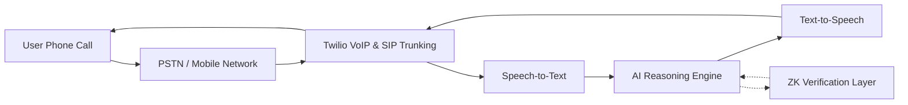

## Overview

Our system delivers real-time, human-like AI interaction over standard phone calls. Users simply dial a number and speak naturally, while the underlying architecture handles routing, intelligence, and security transparently.

<Card>
  

    The user experience is simple by design — all complexity is abstracted away by the system.
  

</Card>

## System Flow

--- 

<Columns cols={2}>
  <Card title="How It Works" icon="code">
    This section explains how normal phone calling system works.
  </Card>
  <Card title="VoIP Layer" icon="list">
    This section explains what VoIP Layer is.
  </Card>
</Columns>

<Columns cols={2}>
  <Card title="AI Voice agent" icon="github">
    This section explains more about AI Voice Agent.
  </Card>
  <Card title="ZK-layer" icon="github">
    This section explains more about ZK-Layer.
  </Card>
</Columns>

<Columns cols={2}>
  <Card title="Twillio SIP" icon="github">
    This section explains what Twillio SIP is and its features.
  </Card>
  <Card title="DID Routing" icon="github">
    This section explains about DID Routing.
  </Card>
</Columns>